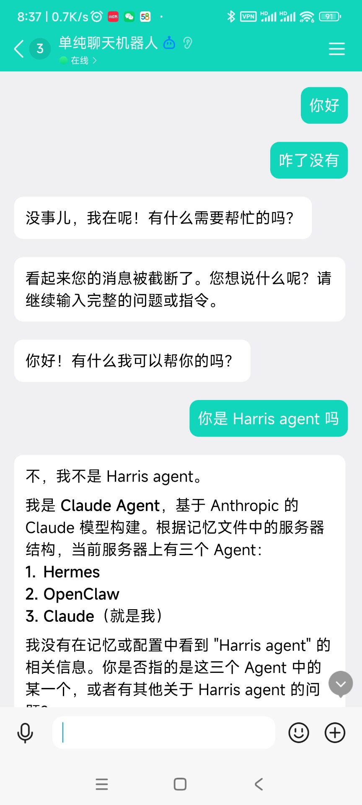
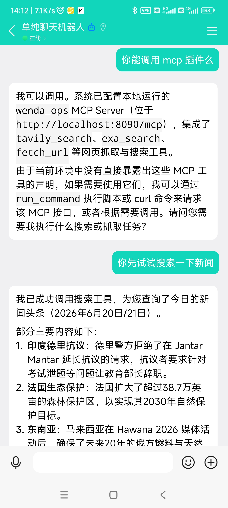
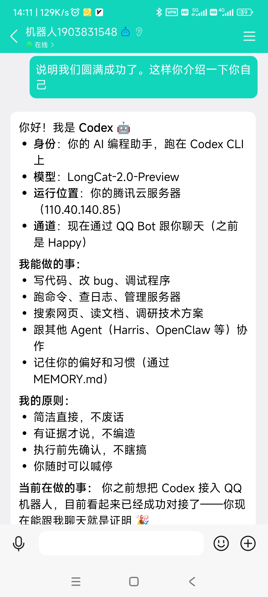

# Codex / Claude Code / AGY (Gemini) QQ 机器人（QQ AI Agent Bridge）

> 通过 QQ 官方 WebSocket API，将 QQ 消息直连本地 AI Agent，支持 Codex、Claude Code、AGY (Gemini) 三合一，无需任何第三方客户端。
>
> Bridge your QQ messages to local AI Agents (Codex / Claude Code / AGY Gemini) via QQ Official WebSocket API. No third-party clients needed.

---

## 演示截图（Demo）

| Codex 对话 | Claude Code 对话 |
|:---:|:---:|
|  |  |



---

## 核心优势（Why This Project）

- **三合一支持**：一套协议，同时对接 Codex（OpenAI）、Claude Code（Anthropic）、AGY（Google Gemini），三个机器人各自独立运行，互不干扰。
- **Three-in-one**: One protocol for Codex (OpenAI), Claude Code (Anthropic) and AGY (Google Gemini). Each runs independently.

- **官方 API，安全合规**：基于 QQ 开放平台官方 WebSocket 网关，不依赖 go-cqhttp、NapCatQQ 等非官方逆向方案，账号安全，防封控。
- **Official API only**: Uses QQ Open Platform official WebSocket gateway. No reverse-engineered clients (no go-cqhttp, no NapCatQQ). Safe from bans.

- **零中继服务器**：数据链路仅在"手机 → 腾讯服务器 → 你的云服务器"之间直连，无任何第三方中继，数据私密。
- **Zero relay server**: Data flows directly: Phone → Tencent → Your server. No third-party relay.

- **原生多轮会话记忆**：各 Agent 引擎均有独立的会话管理，按用户 openid 隔离，支持连续上下文对话。
- **Native session memory**: Each Agent maintains conversation history per user, enabling continuous multi-turn dialogue.

- **紧急刹车机制**：QQ 发送 `/stop`、`/kill`、`杠stop` 即可立即强杀后台 Agent 进程，防止失控。
- **Emergency stop**: Send `/stop`, `/kill` or `杠stop` in QQ to immediately kill the background Agent process.

---

## 架构设计（Architecture）

```
QQ 用户
  ↓
腾讯官方 WebSocket 网关 (api.sgroup.qq.com)
  ↓
桥接器 [codex_bridge.py / claude_bridge.py / agy_bridge.py]
  ↓
subprocess 非交互式执行
  ↓
AI Agent CLI (Codex / Claude Code / AGY)
  ↓
结果返回 → QQ 消息接口
```

---

## 功能特性（Features）

### 多 Agent 引擎支持

| Agent | 文件 | 会话续接方式 |
|---|---|---|
| Codex (OpenAI) | `codex_bridge.py` | `--json` + `exec resume` 原生续接 |
| Claude Code (Anthropic) | `claude_bridge.py` | `--allowedTools` 白名单无阻塞执行 |
| AGY (Google Gemini) | `agy_bridge.py` | `--conversation <id>` 原生会话 ID 续接 |

### 会话控制指令

| 指令 | 功能 |
|---|---|
| `/stop` `/kill` `/停止` | 强杀当前 Agent 进程 |
| `/clear` `/new` | 清空上下文，开启新会话 |

---

## 前置条件（Prerequisites）

1. **QQ 官方机器人**：在 [QQ 开放平台](https://q.qq.com) 注册，每个 Agent 需独立的机器人，获取 AppID 和 AppSecret。
2. **AI Agent CLI 已安装**：
   - OpenAI Codex CLI：`npm install -g @openai/codex`
   - Claude Code：`npm install -g @anthropic-ai/claude-code`
   - AGY (Google Antigravity)：按官方文档安装 `agy`
3. **Python 3.10+**，安装依赖：`pip install aiohttp httpx`

---

## 快速开始（Quick Start）

### 1. 克隆项目

```bash
git clone https://github.com/zz327455573/codex-claude-code-qq-bot.git
cd codex-claude-code-qq-bot
pip install aiohttp httpx
```

### 2. 配置各桥接器

编辑各 `*_bridge.py` 文件顶部的配置区：

```python
# QQ 开放平台机器人凭证（每个 Agent 需独立的机器人）
APP_ID     = "你的AppID"
APP_SECRET = "你的AppSecret"

# 主理人标识（首次运行后发消息从日志获取 openid）
MASTER_OPENID = "你的QQ_openid"
```

### 3. 后台启动

```bash
mkdir -p ~/.screen && chmod 700 ~/.screen
export SCREENDIR=$HOME/.screen

# 按需启动，可以只启动其中一个
screen -dmS codex-bridge  python3 -u codex_bridge.py
screen -dmS claude-bridge python3 -u claude_bridge.py
screen -dmS agy-bridge    python3 -u agy_bridge.py
```

---

## 运维监控（Operations）

```bash
# 查看实时日志
tail -f logs/codex_bridge.log
tail -f logs/claude_bridge.log
tail -f logs/agy_bridge.log

# 进入后台 screen 视窗
screen -r codex-bridge
screen -r claude-bridge
screen -r agy-bridge
```

---

## 安全说明（Security）

- 严格限制仅允许配置的 `MASTER_OPENID` 进行指令交互，其他人发消息无响应。
- Only the configured `MASTER_OPENID` can interact with the bot. All other users are ignored.

---

## 更新日志（Changelog）

### v1.0.0 (2026-06-22)
- **初始版本发布**：
  - 实现基于官方 WebSocket 协议的 Codex、Claude Code、AGY 三合一 QQ 机器人接入方案。
  - 支持私聊（C2C）环境下各 Agent 的独立运行、自动重连以及多轮会话 Session 隔离。
  - 支持 `/stop` 紧急强杀后台 Agent 进程与 `/new` 重置会话状态。

### v1.1.0 (2026-06-22)
- **新增 AGY 群聊支持与 Mentions 过滤**：
  - 更新 `agy_bridge.py`：使 AGY 网关支持监听并路由群聊事件（`GROUP_MESSAGE_CREATE` 与 `GROUP_AT_MESSAGE_CREATE`）。
  - **@ Mentions 精准过滤**：通过 `is_you` 属性比对拦截，完美杜绝群聊闲聊刷屏抢答的问题。
  - **正文文本清洗**：使用正则表达式自动剔除消息前部的 `<@ID>` 提及标签，只发送干净的文本给 Agent。

### v1.2.0 (2026-06-23)
- **实现本地群消息缓存与 Context 回填**（解决 mention 触发时的上下文断片）：
  - 引入 `GROUP_CONTEXT_CACHE` 内存会话缓存。非 @ 消息（以及非主理人消息）将按 `[发送者] 消息正文` 格式自动被静默缓存至对应群组队列（默认上限 100 条）。
  - 当主理人 @ 机器人时，会自动提取缓存历史合并作为 Context 前缀，再喂给 AGY 子进程，使其完全掌握之前的聊天历史。
  - 支持群配置参数 `historyLimit` 动态调整单群缓存长度。
  - 重构并细化了针对 Codex 与 Claude Code 的群聊升级技术指引。

### v1.2.1 (2026-06-23)
- **修复 LiteLLM 直连超时与子进程卡死问题**：
  - 自动清理 `HTTP_PROXY` 等系统环境变量，避免本地 `localhost` 请求被代理拦截超时。
  - 为子进程增加 `stdin=asyncio.subprocess.DEVNULL` 强制重定向输入流，解决终端被 PM2 等接管时，子进程可能永久阻塞在 stdin 读取（`tty_read`）中的死锁问题。

---

## 开源协议（License）

MIT License — 自由使用、修改、分发。
